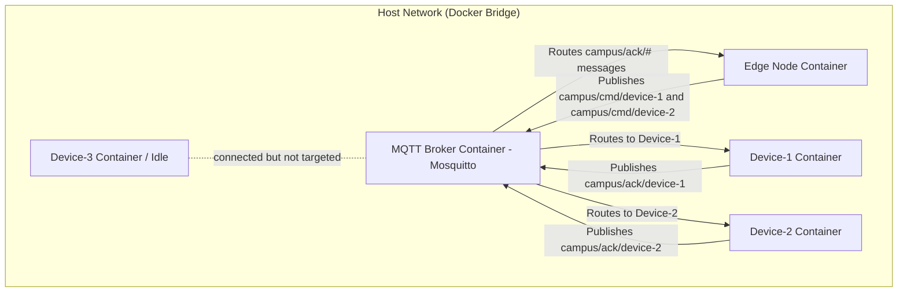

# CAMPUS Edge–Device Communication Testbed (MQTT Implementation)

This directory contains the **MQTT protocol implementation** for the CAMPUS (Cooperative Aggregation & Mapping for Perception in Ubiquitous Sensing) experiment testbed. It is a sub-module of the ENVELOPE project under EU Horizon Europe.

---

## 1. Context and Goal

This repository serves as a **lab testbed** focusing on the **vehicle–edge communication layer** for cooperative perception and dynamic HD map services over a 5G campus network. 

In the actual CAMPUS deployment:
* **Vehicles** run local perception algorithms on NVIDIA Orin-class On-Board Units (OBUs).
* **Edge Servers** receive object-level perception data from multiple vehicles, fuse them to maintain a dynamic HD map, and push relevant map updates back to target vehicles.

This testbed **does not** implement perception or mapping logic. Instead, it isolates the communication segment so we can evaluate latency, reliability, and selective downlink behaviour under different protocol stacks (gRPC, Zenoh, and MQTT).

---

## 2. System Architecture & Emulation

We emulate a simplified slice of the CAMPUS architecture:



* **Edge Node:** Application that publishes selective commands on `campus/cmd/<device-id>`, subscribes to acknowledgements on `campus/ack/#`, and logs per-device latency statistics.
* **MQTT Broker (Eclipse Mosquitto):** Broker component that forwards matching pub/sub messages between publishers and subscribers.
* **Devices (Far Edge / Vehicles):** Client processes that subscribe to their own command topic (`campus/cmd/<device-id>`) to receive updates, and publish acknowledgments to `campus/ack/<device-id>`.
* **Idle Devices:** Devices (like `device-3` in the diagram) that connect to the MQTT broker but do not receive any downlink commands. These are explicitly included in the testbed to emulate a connected vehicle that remains in the network but is excluded from selected downlink to model relevance filtering.

---

## 3. Directory Structure

The directory is structured as follows:

```text
mqtt/
├── docker/
│   ├── Dockerfile.edge       # Container recipe for the Edge Node
│   └── Dockerfile.device     # Container recipe for the Device Simulators
├── src/
│   ├── edge_mqtt.py          # Main edge controller & statistical logging script
│   └── device_mqtt.py        # Main device client simulator script
├── scripts/
│   └── run_devices.py        # Host-level local multi-device launcher script
├── results/
│   └── results_mqtt_*.csv    # Generated RTT metric files (synced from Docker)
├── docker-compose.yml        # Orchestration for the complete local testbed network
├── mosquitto.conf            # Mosquitto broker configuration file
├── exp_baseline_mqtt.ps1     # Windows PowerShell experiment automation script
├── exp_baseline_mqtt.sh      # Linux/macOS Bash experiment automation script
└── README.md                 # Project documentation
```

---

## 4. Features & Current Status

* **[Implemented] Configurable payload and rate constraints:** Payload size and sending rate can be set dynamically via environment variables (`PAYLOAD_BYTES`, `INTERVAL_SEC`) or command-line arguments.
* **[Implemented] Configurable QoS:** MQTT Quality of Service (0, 1, or 2) can be configured globally.
* **[Implemented] RTT Statistics & CSV Logging:** Edge logs latencies, calculates min/avg/p95 statistics, and writes a CSV file on shutdown.
* **[Implemented] Automated Experiment Harness:** Automated script setups to spin up infrastructure, run baseline experiments, and tear everything down cleanly.
* **[Implemented] Containerized Topology (Docker Compose):** Full broker, edge, and device network setup.
* **[Implemented] Docker Signal Propagation:** Code maps `SIGTERM` to raise a `KeyboardInterrupt` inside the container for graceful statistics flush on container stop.
* **[Implemented] Local Concurrency Runner:** Script to spawn multiple device processes on the host.
* **[Planned] MQTT-over-QUIC Transport Option:** Moving to NanoMQ in week 2 for QUIC transport evaluation.

---

## 5. Getting Started

Make sure you have Python 3 and `paho-mqtt` installed (if running locally), or Docker & Docker Compose (if running containerized).

### Method A: Automated Experiment Harness (Recommended)

This method uses one script to automatically verify/start the Mosquitto broker in Docker, spawn simulated devices in the background, run the foreground edge experiment node for a set duration, and clean up everything when finished.

#### On Windows (PowerShell):
```powershell
.\exp_baseline_mqtt.ps1 -Devices 5 -DurationSec 10 -IntervalSec 0.2 -OutputCsv results/mqtt_test.csv
```

#### On Linux / macOS / Git Bash:
```bash
./exp_baseline_mqtt.sh 5 100 0.2 10 results/mqtt_test.csv
# Syntax: ./exp_baseline_mqtt.sh [devices] [payload_bytes] [interval_sec] [duration_sec] [output_csv]
```

At the end of the run, you will see a statistical summary table in console stdout, and a CSV file generated under `results/`.

### Method B: Running with Docker Compose (Containerized Topology)

This method sets up an isolated virtual bridge network where each container gets its own IP address.

1. **Start the testbed:**
   ```bash
   docker compose up --build
   ```
2. **Observe:** The terminals will print logs from the edge node and the targeted device processes.
3. **Stop & Save Statistics:** Press `Ctrl + C` in the running terminal. The containers will capture the `SIGTERM` signal, stop gracefully, and dump the RTT metrics into the local `./results/` folder.
4. **Clean up containers:**
   ```bash
   docker compose down
   ```

### Method C: Running Locally (For Fast Development)

This method runs all elements directly on your host machine's loopback interface.

1. **Start your local Mosquitto Broker:**
   Ensure you have Mosquitto installed locally and start it with anonymous connections allowed, or run a standalone container:
   ```bash
   docker run -d --name mqtt-broker-local -p 1883:1883 -v "$(pwd)/mosquitto.conf:/mosquitto/config/mosquitto.conf" eclipse-mosquitto:2
   ```
2. **Spawn 10 simulated devices:**
   Open a separate terminal window and run:
   ```bash
   python scripts/run_devices.py
   ```
3. **Start the Edge node with custom options:**
   Open another terminal window and run:
   ```bash
   python src/edge_mqtt.py --devices 10 --duration 60 --payload-size 100 --interval 0.1 --output results/my_run.csv
   ```
4. **Termination & Cleanup Lifecycle:** 
   * **Edge Node:** Press `Ctrl + C` in the edge terminal. It intercepts the signal to write the RTT latency CSV file to your local directory and disconnects.
   * **Device Subprocesses:** Press `Ctrl + C` in the runner terminal. The script intercepts the keyboard interrupt and loops through all spawned subprocesses, sending termination signals (`SIGTERM`) to clean up client processes gracefully.
   * **Broker:** The local broker container/process can be stopped separately.

---

## 6. Experiment Parameters & Outputs

### Edge Node CLI Arguments
You can customize local execution or the Edge node process with the following CLI arguments (which also fall back to environment variables):

| Argument | Environment Variable | Default | Description |
|---|---|---|---|
| `--broker` | `MQTT_BROKER` | `localhost:1883` | MQTT broker endpoint address |
| `--devices` | `TARGET_DEVICES` | `device-1,device-2` | Comma-separated target device IDs, or integer `N` for auto `device-1` to `device-N` |
| `--duration` | `RUN_DURATION` | `0.0` | Experiment duration in seconds (`0` or negative runs indefinitely) |
| `--max-messages`| `MAX_MESSAGES` | `0` | Max messages to send per device before stopping |
| `--payload-size`| `PAYLOAD_BYTES` | `100` | Size of the test payload in bytes |
| `--interval` | `INTERVAL_SEC` | `1.0` | Sending interval delay in seconds |
| `--output` | `OUTPUT_CSV` | *auto-generated* | Custom output path for results CSV file |
| `--qos` | `MQTT_QOS` | `1` | MQTT Quality of Service level: 0, 1, or 2 |

### Output CSV Format
The generated CSV file writes each individual round-trip packet event with the following columns:
* `device_id`: The identifier of the simulator device.
* `send_ts_ns`: Timestamp in nanoseconds when the edge node sent the message.
* `recv_ts_ns`: Timestamp in nanoseconds when the edge node received the acknowledgment.
* `latency_ms`: Calculated RTT latency in milliseconds (`(recv_ts_ns - send_ts_ns) / 1,000,000`).

---

## 7. Constraints and Non-Goals

* **No raw sensor data:** Only structured messages (telemetry/commands) are exchanged.
* **No ROS2/DDS stack (yet):** Focuses solely on the vehicle-edge transit layer.
* **Single edge node:** Load balancing, multi-edge routing, and container migrations are out of scope.
* **No multi-edge coordination yet:** Only one edge controller and one MQTT broker are in scope.
